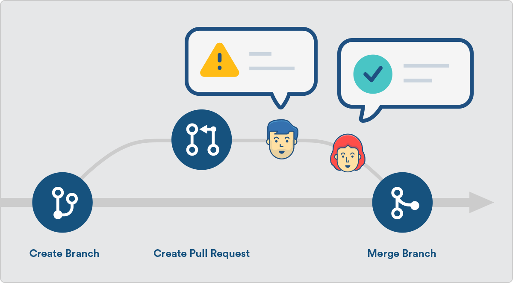

# Studious-liberty

## Bài tập nhóm 
Bài mẫu: https://demo.w3layouts.com/demos_new/template_demo/01-02-2021/diner-liberty-demo_Free/668605264/web/index.html
## Thành viên gồm: 

Bạch Đăng Tuấn

Đinh Văn Hữu Nghĩa

Hà Thị Ngọc Anh

## Nội dung công việc:

### Bạch Đăng Tuấn
- Khởi tạo repo cấu trúc thư mục source code.
- Làm content header, footer, carousel

### Đinh Văn Hữu Nghĩa
- Chia bộ cục bài làm
- Làm content Deliciousness, post blog, testimonial

### Hà Thị Ngọc Anh
- Tải ảnh và cập nhật source ảnh
- Làm news, about us

## Quy trình thực hiện:

Lưu ý khi code: chỉ được thực hiện code trên nhánh cá nhân, ko được code trực tiếp trên nhánh master. (nếu sửa trên master phải thông qua ý kiến của đồng đội).

Clone code default về lần đầu tiên.
Tạo branch cá nhân và dev => push code lên branch cá nhân => 3-4 ngày merge code 1 lần về branch master.
=> Test => Sau đó pull về nhánh làm tiếp => Push & Merge => Test => Release

Merge code:
- Không nên tự merge, nếu merge thông báo lại để phân công merge. 
- Kiểm tra kĩ code sau đó merge.
- Merge xong kiểm tra lại release
- Thông báo đồng đội Pull code về branch dev làm tiếp. 

PULL => PUSH => MERGE => TEST => RELEASE